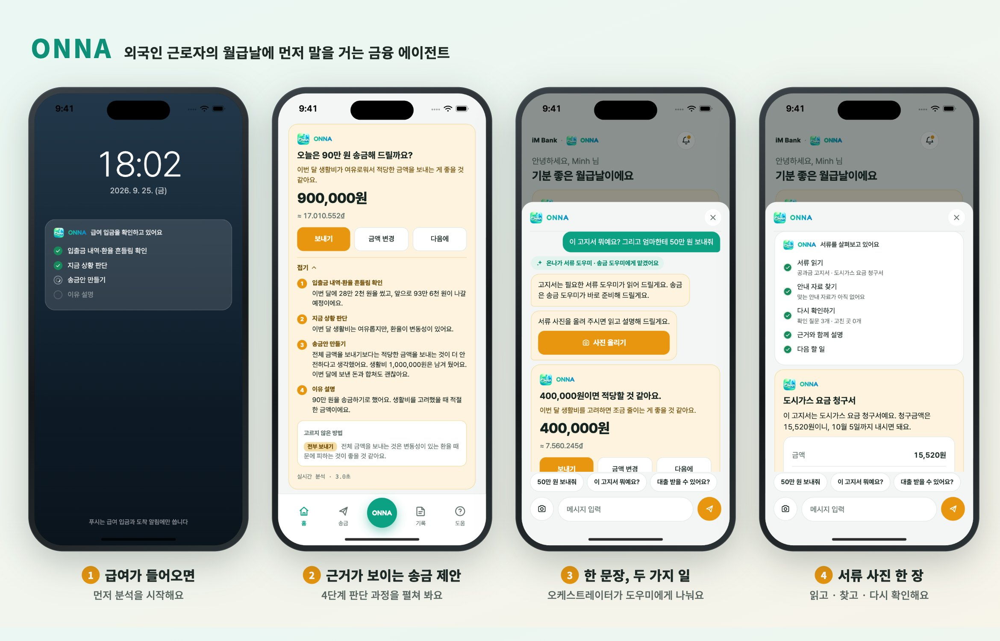
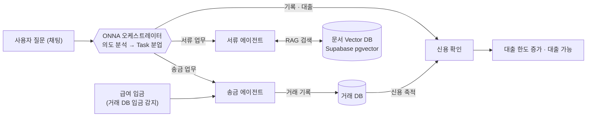
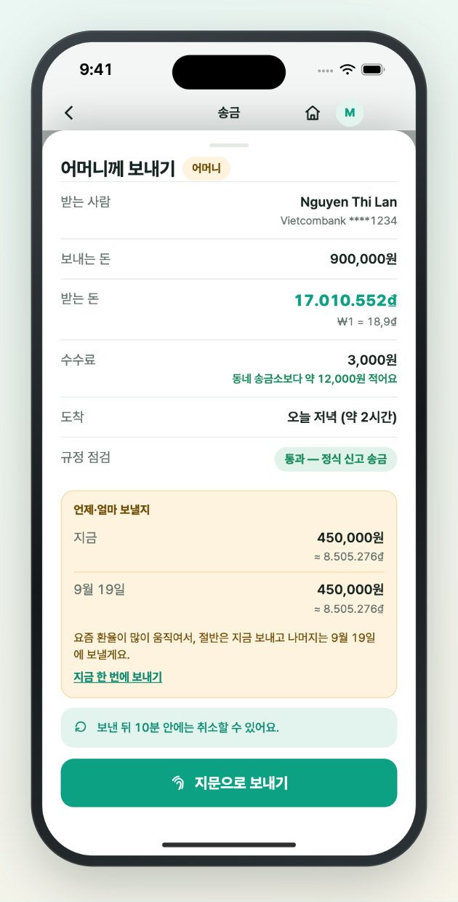

<p align="center">
  
</p>

<h1 align="center">&nbsp;ONNA</h1>

<p align="center">
  <b>외국인 근로자의 월급날에 먼저 말을 거는 금융 에이전트</b><br>
  iM뱅크 앱 안에서 송금 · 서류 · 신용을 모국어로 돕습니다. 판단은 코드가, 설명은 AI가 맡습니다.
</p>

<p align="center">
  <a href="https://onna-mvp.vercel.app"><b>라이브 데모 열기 →</b></a>
  &nbsp;·&nbsp; <a href="#1분-체험">1분 체험</a>
  &nbsp;·&nbsp; <a href="#바로-실행하기">바로 실행하기</a>
  &nbsp;·&nbsp; <a href="#에이전트-구조">에이전트 구조</a>
</p>

---

## 왜 필요한가

외국인 근로자의 월급날에는 풀어야 할 문제가 한꺼번에 몰립니다.

- **얼마를 보내야 할지 모른다.** 월세·생활비·환율을 머릿속으로 계산하다가 너무 많이 보내거나, 환율이 나쁜 날 보냅니다.
- **한국어 서류를 읽기 어렵다.** 고지서·급여명세서의 금액과 납기일을 놓치면 연체료가 붙습니다.
- **성실하게 일해도 신용이 쌓이지 않는다.** 급여와 송금 기록이 흩어져 있어 대출 심사에 쓰이지 않습니다.

ONNA는 이 세 문제를 한 앱에서 풉니다.

| | ONNA가 하는 일 |
|---|---|
| **먼저 제안해요** | 급여가 들어오면 입출금 내역과 환율 흔들림을 보고 "오늘은 90만 원 보내 드릴까요?"라고 먼저 묻습니다. 판단 근거도 펼쳐 보여 줍니다. |
| **언제 보낼지도 정해요** | 사용자가 승인하면 금액을 **지금 · 나눠서 · 예약** 중 알맞게 나눠 보냅니다. 예약한 돈은 그날까지 계좌에 그대로 있습니다. |
| **서류를 모국어로 풀어요** | 고지서 사진 한 장이면 글자를 읽고, 안내 자료를 찾고, 원본과 **다시 대조**한 뒤 항목마다 출처를 붙여 설명합니다. |
| **기록이 신용이 돼요** | ONNA로 쌓인 급여·송금 기록이 6개월을 채우면 대출이 열리고, 송금할 때마다 한도가 늘어납니다. |

인도네시아어 · 네팔어 · 베트남어 · 영어 · 한국어 5개 언어를 지원하고, 모든 금액을 원화와 본국 통화로 함께 표기합니다.

---

## 1분 체험

**[onna-mvp.vercel.app](https://onna-mvp.vercel.app)** 을 데스크톱에서 여세요. 가운데가 근로자의 휴대폰이고, 오른쪽이 시연용 **데모 콘솔**입니다.

| 보고 싶은 것 | 이렇게 하세요 |
|---|---|
| **급여날 먼저 말 거는 에이전트** | 콘솔에서 `시작: 홈` → `세션 초기화` → `급여 입금 발생`. 잠금화면에서 4단계 분석이 진행되고 푸시가 옵니다. `보내기`를 누른 뒤 제안 카드의 **어떻게 정했는지 보기**를 펼치세요. |
| **지금 · 나눠서 · 예약** | 급여 입금 **전에** 콘솔 `환율 상황`에서 `흔들림 → 나눠 보내기`(또는 `낮음 → 예약`)를 고르세요. 제안 카드에서 `보내기`를 누르면 확인 화면에 "언제·얼마" 계획이 나옵니다. 예약분은 콘솔 `예약일 도래`로 실행합니다. |
| **한 문장에 두 가지 일** | 휴대폰 하단 가운데 **ONNA** 버튼 → "이 고지서 뭐예요? 그리고 50만 원 보내줘". 오케스트레이터가 서류 도우미와 송금 도우미에게 일을 나눠 줍니다. |
| **서류 사진 설명** | 하단 `도움` 탭 → `서류 사진 찍어 물어보기` → `사진 찍기`. 데모용 가상 가스 청구서로 실제 분석이 돌아갑니다(약 15초). |
| **기록이 신용이 되는 순간** | 콘솔 페르소나 `Budi` → `급여 입금 발생`. 기록이 6개월을 채워 홈에 "이제 대출을 받을 수 있어요" 카드가 뜹니다. |
| **한국어로 보기** | 콘솔 `첫 온보딩 화면으로` → 국적에서 `대한민국`을 고르고 가입 흐름을 따라가세요. (`시작: 홈`은 페르소나의 모국어로 시작합니다.) |

> 휴대폰에서는 `https://onna-mvp.vercel.app/?device=1` 로 여세요. 오른쪽 아래 ⚙ 버튼이 데모 콘솔입니다.

---

## 에이전트 구조



오케스트레이터와 각 에이전트는 **단계마다 진행 상황을 앱에 보여 줍니다.** 사용자가 AI의 판단 과정을 직접 확인할 수 있습니다.

### 오케스트레이터 — `/api/orchestrate`

채팅 한 문장을 읽고 최대 두 개의 업무로 나눠 **송금 · 서류 · 신용 · 일반** 도우미에게 넘깁니다. 금액은 사용자 문장에서 코드가 직접 읽은 값만 인정하고, LLM이 실패하면 키워드 분류로 대신합니다.

### 송금 에이전트 — `/api/remit-plan`

<table>
<tr>
<td width="58%" valign="top">

| 단계 | 담당 |
|---|---|
| ① 입출금 내역·환율 흔들림 확인 | 코드 |
| ② 지금 상황 판단 (여유 / 빠듯) | 코드 |
| ③ 송금안 만들기 → 규칙 엔진 사전점검 | LLM + 코드 |
| ④ 이유 설명 | LLM |
| ⑤ 사용자 승인 | 사용자 |
| ⑥ **타이밍 결정** — 지금 / 나눠서 / 예약 | 코드 |
| ⑦ 송금 실행 → 거래 DB 기록 | 코드 |

- 급여 입금(웹훅)과 채팅 요청이 같은 파이프라인을 씁니다.
- ⑥은 사용자가 금액을 바꿔도 **최종 금액 기준**으로 다시 정합니다.
  - 환율이 평소보다 낮으면 → 예약
  - 환율이 많이 흔들리고 40만 원 이상이면 → 절반만 지금 보내기
- 에이전트가 나누거나 미뤄도, 사용자가 버튼 하나로 `지금 한 번에 보내기`를 고를 수 있습니다.

</td>
<td width="42%" valign="top"></td>
</tr>
</table>

### 서류 에이전트 — `/api/doc-agent`

| 단계 | 하는 일 |
|---|---|
| ① 서류 읽기 | 사진에서 종류·금액·납기일·주요 글자를 읽습니다(OCR). 이름·주소·고객번호는 뽑지 않습니다. |
| ② 안내 자료 찾기 | 질의를 임베딩해 문서 Vector DB에서 관련 자료를 찾습니다(RAG). |
| ③ 다시 확인하기 | **CoVe(Chain-of-Verification)** 단계입니다. 아래 순서로 진행합니다. |
| ④ 근거와 함께 설명 | 항목마다 `서류 원문` / `안내 자료` 출처 칩을 붙입니다. |
| ⑤ 다음 할 일 | 앱이 실제로 실행할 수 있는 행동만 추천합니다(자동이체, 납기 알림, 한국어 문장, 상담 연결 등). |

③ 다시 확인하기의 순서:
1. 근거가 달린 초안과 검증 질문을 만듭니다.
2. **초안을 보지 않은 채** 원본 사진과 자료만으로 질문에 답합니다.
3. 두 답이 어긋난 항목이 있을 때만 수정합니다.

사진과 원문은 저장하지 않습니다. 분석하는 동안 메모리에만 두고, 끝나면 지웁니다.

### 데이터 · 신용 — `src/agent/credit.ts`

원장에서 **검증된 기록**만 셉니다. 검증된 급여 개월 수로 대출 가능 여부를 정하고, 한도는 아래 식으로 계산합니다.

```
기본 50만 원 + 개월 × 20만 원 + 검증된 송금 × 5만 원   (최대 300만 원)
```

기록이 바뀔 때마다 신용을 다시 계산해 "대출이 열렸어요", "한도가 늘었어요" 알림을 띄웁니다.

### 믿고 쓸 수 있게 만든 장치

- **판단은 코드, 문장은 LLM.**
  - 금액 상한·환율 판정·상황 판단·타이밍·신용은 코드가 정합니다.
  - LLM에는 계산이 끝난 근거 값만 넘깁니다.
- **LLM 응답은 가드레일을 통과해야 화면에 나갑니다.** 검사 항목은 다음과 같습니다.
  - 근거 없는 숫자
  - 금지어
  - 어투: 한국어 해요체, 베트남어 존칭
  - 한도 수치 노출
  - 통화 표기
  - 다른 언어가 섞인 문장
- **실패해도 멈추지 않습니다.**
  - 모든 단계에 코드 폴백이 있습니다.
  - 화면에는 `실시간 분석 · 2.7초` / `기본 계산`처럼 실제로 어떤 경로를 썼는지 표시합니다.
- **돈은 확인 없이 움직이지 않습니다.**
  - 모든 실행은 확인 화면과 지문 인증을 거칩니다.
  - 보류 중일 때는 "돈은 아직 나가지 않았어요"를 반드시 표시합니다.

---

## 바로 실행하기

### 1. 화면만 띄우기 — 설정 없음

```bash
git clone https://github.com/h01024380577-blip/ONNA.git
cd ONNA
npm install
npm run dev          # → http://localhost:5199
```

**API 키가 필요 없습니다.** `localhost:5199`는 배포본(onna-mvp.vercel.app)의 API를 자동으로 부릅니다(`src/lib/api.ts`). 화면만 고치는 작업이라면 여기까지면 충분합니다.

> Node.js 20.6 이상이 필요합니다(24에서 검증).

### 2. API까지 내 컴퓨터에서 돌리기

```bash
cp .env.example .env.local      # 필요한 키만 채우세요 (아래 표)
npx vercel link                 # 처음 한 번 — 본인 Vercel 프로젝트에 연결
set -a; . ./.env.local; set +a  # vercel dev 가 .env.local 을 직접 읽지 않아서 셸로 넘긴다
npx vercel dev --listen 3000    # → http://localhost:3000 (화면 + /api/*)
```

| 환경변수 | 필요한 곳 | 비워 두면 |
|---|---|---|
| `OPENAI_API_KEY` | 의도 분석 · 송금안 · 서류 분석 | 모든 에이전트가 코드 폴백으로 동작 |
| `KOREAEXIM_FX_KEY` · `KOREAEXIM_LEND_KEY`<br>(또는 공용 `KOREAEXIM_API_KEY`) | 실시간 환율 · 대출 기준금리 | 목업 값 사용 |
| `SUPABASE_URL` · `SUPABASE_PUBLISHABLE_KEY` | 서류 에이전트의 안내 자료 검색 | "맞는 안내 자료가 아직 없어요"로 진행 |
| `SUPABASE_DB_URL` | 마이그레이션 · 자료 적재 스크립트 | 스크립트만 못 씀 (배포에는 올리지 않음) |

모든 키는 서버 함수에서만 읽고, 브라우저로 나가지 않습니다.

### 3. 문서 Vector DB 붙이기 — 선택

1. Supabase 프로젝트를 만듭니다. 대시보드 **Connect → Transaction pooler** 주소를 `SUPABASE_DB_URL`에, Project URL과 publishable 키를 나머지 두 변수에 넣습니다.
2. 스키마와 검색 함수를 적용하고, 공개 키 권한을 확인합니다.
   ```bash
   npm run db:migrate   # 스키마 · 검색 함수(RPC) 적용
   npm run guide:check     # "✓ 권한 구성 정상"이 나오면 준비 완료
   ```
   공개 키로는 검색 함수만 부를 수 있고, 테이블은 직접 읽을 수 없습니다.
3. 안내 자료(`.md` · `.txt` · `.pdf`)를 `guides/`에 넣고 `guides/sources.json`을 작성한 뒤 적재합니다. 작성법은 [`guides/README.md`](guides/README.md)를 보세요.
   ```bash
   npm run guide:ingest
   ```
   `guides/` 원본 파일은 커밋되지 않습니다.

### 4. 배포 · iOS

- **배포:** `npx vercel --prod`. Vercel 환경변수에 위 표의 값을 넣으세요(`SUPABASE_DB_URL` 제외).
- **iOS (Capacitor):** `npm run dev`를 먼저 띄운 뒤 `npx cap open ios`로 Xcode에서 실행합니다.
  - 앱은 개발 서버(`localhost:5199`)를 직접 불러와서, 코드를 고치면 바로 반영됩니다.

---

## 명령어

| 명령 | 하는 일 |
|---|---|
| `npm run dev` | 개발 서버 (포트 5199) |
| `npm test` | 단위 테스트 (vitest) |
| `npm run build` | API 호출 주소 검사 후 프로덕션 빌드 |
| `npm run check:api` | `/api` 를 상대경로로 부른 곳이 없는지 검사 |
| `npm run db:migrate` | `supabase/migrations/*.sql` 적용 (적용 기록을 남겨 두 번 실행해도 안전) |
| `npm run guide:check` | Supabase 공개 키 권한 확인 |
| `npm run guide:ingest` | `guides/` 안내 자료 → 청크 → 임베딩 → DB 적재 (다시 실행해도 결과가 같음, 다른 폴더는 `-- <폴더>`) |

## 폴더 구조

```
api/                     Vercel Edge Functions — 키는 여기서만 읽는다
  orchestrate.ts         의도 분석 · Task 분업
  remit-plan.ts          송금안 + 이유 설명
  doc-agent.ts           서류 에이전트 (ocr · search · draft · verify · revise)
  fx.ts · fx-brief.ts · rates.ts   실시간 환율 · 환율 한 줄 해설 · 대출 기준금리
  _lib.ts · _guides.ts       공용 가드레일 · 임베딩과 Vector DB 호출
src/
  agent/                 에이전트 로직 — 대부분 순수 함수 + 테스트
    useOrchestrator · useRemitAgent · useDocAgent   단계를 진행시키는 훅
    orchestrator · situation · timing · credit · cove · docRules · koRegister …
  app/                   근로자 앱 화면 (Chat · RemitCard · DocRunCard · screens/)
  sim/                   데스크톱 시뮬레이터 · 데모 콘솔
  web/                   사장님 · 가족 화면
  mock/                  은행 코어 · 규칙 엔진 · 원장 목업
  i18n/                  5개 언어 문구
  store.tsx              앱 상태와 리듀서
supabase/migrations/     pgvector 스키마 · 검색 함수
scripts/                 API 주소 검사 · 마이그레이션 · 자료 적재
guides/                      안내 자료 원본 (커밋 안 됨)
docs/superpowers/        설계 문서(specs) · 구현 계획(plans)
```

## 데모 콘솔

| 영역 | 할 수 있는 일 |
|---|---|
| 온보딩 | 로딩 화면부터 다시 시작 (국적 선택) |
| 화면 | 근로자 앱 · 사장님 화면 · 가족 화면 전환 (확인할 알림 수 표시) |
| 이벤트 트리거 | 급여 입금 · 송금 도착 · 예약일 도래 · 세션 초기화 |
| 페르소나 | Budi(인도네시아, 대출까지 1개월) · Sita(네팔, 취소 없이 즉시 확정) · Minh(베트남) / 시작점: 온보딩 · 홈 |
| 규정 점검 시나리오 | 자동 판정 · 통과 강제 · 보류 3종 (월 한도 · 소득 서류 · 신규 수취인) |
| 환율 상황 | 실제 · 흔들림(→ 나눠 보내기) · 낮음(→ 예약) |
| 데이터 출처 | 환율 · 기준금리 · 송금 분석 · 의도 분석 · 서류 분석 · 문서 검색이 실시간인지 폴백인지 표시 |
| 기타 | 다크 모드 · 등록증 인식 실패 재현 · 신용 6개월 충족 |

## 코드를 고칠 때 알아 둘 것

- **API는 `apiUrl('/api/…')`로 부르세요.** 상대경로로 부르면 iOS에서 404가 나서 빌드가 막힙니다.
- **새 문구는 5개 언어 파일(`src/i18n/*.ts`) 모두에 넣으세요.**
  - 금지어: 거절 · 차단 · 위반 · 블록체인 · DID · 크리덴셜 · 토큰.
- **이모지 대신 `Icon` 컴포넌트를 쓰세요.** iOS 웹뷰에서 이모지가 깨집니다.
- **금액·판정은 코드에서 계산하세요.** LLM에는 계산이 끝난 값만 넘깁니다.
- **데모 설정을 새로 만들면 `store.tsx`의 `RESET` 이월 목록에 추가하세요.** 빠뜨리면 세션을 초기화할 때 설정이 풀립니다.
- **설계 배경과 실측 결과:** [`docs/superpowers/specs/`](docs/superpowers/specs/)

## 범위 밖

- iM뱅크 샌드박스가 없는 단계라, 은행 코어와 규칙 엔진은 인터페이스 계약대로 **목업**으로 재현했습니다.
- 이번 MVP에 넣지 않은 것:
  - 스테이블코인 정산 · 블록체인 기록
  - 이상거래탐지
  - 실제 대출 실행과 공과금 납부
  - 사업장 이동 · 귀국 처리
  - 고용주 콘솔 전체 기능

---

<p align="center"><sub>2026 AI · Blockchain Challenge in Daegu 출품작 · iM뱅크 외국인 근로자 금융 정착 에이전트</sub></p>
